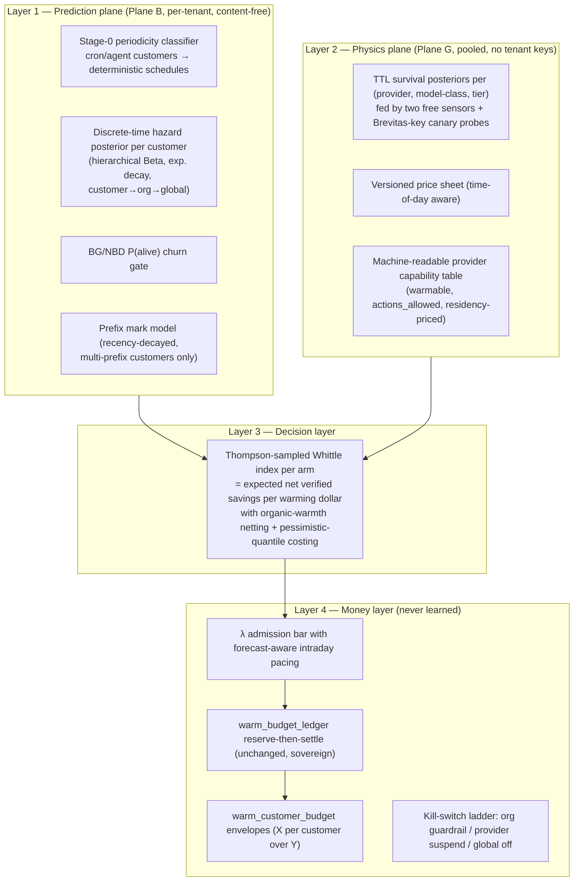

# Learned Predictive Warming: Research & Build Plan

**Brevitas Systems — August 2026**

*Produced by a 14-agent research workflow: 3 codebase audits, 6 literature/industry research angles, 3 independent competing system designs, a judged design competition, and an adversarial failure-mode review. All claims about the current codebase carry file:line references; all research claims carry sources.*

---

## Executive summary

**The question:** can we treat each org's end customers as individuals — learn when they're online, what they use, allocate each a warming budget over a period, and pre-cache what their past behavior predicts — with a full reinforcement learning algorithm?

**The answer: yes, and the right formulation is precise.** The literature and three competing designs converge on the same architecture, and it is *not* an end-to-end deep RL agent — no production system in this space has ever shipped one (Google's HALP, Meta's Baleen, Princeton's Learned Prefix Caching all use learned predictors feeding analytic decision rules; the one direct-RL cache paper never left the lab). The formulation that fits exactly, with deployment precedent at our data scale, is a **budgeted restless multi-armed bandit with a Thompson-sampled Whittle index**:

- Every `(org, end customer, provider, prefix)` is an **arm** whose hidden state — is the provider cache still warm? how imminent is the customer's return? — evolves whether or not we act. That's the "restless" property, and it's the textbook match for our problem.
- The **learning** lives in two Bayesian posteriors: a per-customer *return-time hazard model* (when will this customer come back, by hour of week) and a pooled *provider TTL survival curve* (how long does each provider's cache actually live). Both update online from data we already collect.
- The **decision** is an analytic, dollar-denominated **index**: *expected net verified savings per warming dollar of acting on this arm right now*. Ranking arms by index and spending the budget greedily down the ranking is the provably near-optimal policy — and the index number itself is the auditable "importance score" you asked for.
- The **budget** stays a hard, non-learned invariant: the existing reserve-then-settle ledger, extended with per-customer envelopes ("budget X per customer over period Y").
- **Cold start is free by construction:** the index priors are calibrated so that with zero data, the system computes *exactly* the v1 heuristic that's already shipped. Learning only ever moves it away from v1 where evidence supports it. This is also the enterprise-procurement story: "the shipped heuristic is the zero-data special case of the learned system."

**Three facts reshape the plan and must temper expectations:**

1. **Warming ROI is Anthropic-concentrated.** Published 2026 measurements (arXiv 2607.19214) found keepalive warming nets **1.6×** on Anthropic but *loses money* on OpenAI (0.84×), Google (0.6–0.7×), and DeepInfra-hosted DeepSeek (0.7–0.8×) — their caches are sticky or cheap enough that pings buy nothing. First-party DeepSeek's cache lives hours untouched (our own probes: ≥55 min), so its rational action is usually *let-lapse-then-rewarm at 0.02× reads*, not sustain-pinging. Savings projections must be modeled on the **Anthropic share of org traffic**.
2. **Attribution is the biggest billing risk.** Sticky caches are often organically warm; Anthropic's TTL resets free on the customer's *own* reads. Billing 25% of all warm-hit savings without netting out organic warmth **over-bills** — the adversarial review rated this the #1 failure mode. The plan makes a written, testable attribution spec and an attribution-independent control arm non-negotiable (Phase 0).
3. **Production has zero authoritative priced usage since 2026-07-17**, so there is no live reward stream today. Phase 0/1 validation runs on historical `usage_log` replay plus simulation; live learning begins when traffic returns. Nothing in this plan assumes traffic that doesn't exist.

**Strategic honesty:** the keepalive arbitrage is publicly expected to close — the same paper predicts providers will move to metered cache residency (Gemini's explicit caches already bill per token-hour) because universal keepalive destroys their eviction signal. The durable asset this plan builds is the **prediction layer** (when each customer returns, what they'll need) plus **verified attribution** — both retain full value under any cache-pricing regime. That's also the honest investor story.

---

## Part 0 — Enterprise data handling

You asked this first, and it turns out the law, the statistics, and the architecture all point at the same design.

### The two-plane rule (adopt verbatim)

- **Plane G (global, poolable — cache physics):** provider TTL survival curves, read/write price ratios, refresh-on-read behavior, cache-block granularity. Learned from observations carrying **no end-customer or org behavioral keys**. Contains no personal data (documentable under EDPB Opinion 28/2024), so it can pool across all tenants — the Cloudflare precedent (they openly train bot-detection on cross-customer traffic because the learned object is network physics, not a person's profile).
- **Plane B (behavioral, tenant-isolated — people):** per-`(org, end_customer)` return-time hazards, activity rhythms, P(alive), prefix-reuse stats. Lives **only in queryable rows** keyed by tenant, encrypted or HMAC-pseudonymized, never pooled across orgs, never used to serve another org.

This split is close to **legally mandated**, not just good hygiene: CCPA regulations (11 CCR 7050/7051) prohibit a service provider from combining personal information across the businesses it serves, and the "improve our services" carve-out *expressly excludes* building consumer profiles used to serve another business. Pooling per-person behavioral models across orgs would forfeit Brevitas's service-provider status. GDPR-side, Brevitas is an **Article 28 processor**: modeling end-customer behavior is lawful *only as a documented instruction from the controller* — so predictive warming must be an enumerated processing activity in the DPA, and the existing per-org warming opt-in (already structural: `warm_credentials` CHECK constraint requires recorded consent + nonzero budget) becomes that documented instruction.

### Erasure by construction — no machine unlearning, ever

Machine unlearning for pooled gradient models is unsolved in practice. The architecture sidesteps it entirely: because **all** personal-data-derived learned state is per-`(org, customer)` rows (hazard posteriors, histograms, `warm_prefixes`, the new `warm_customer_state`), a deletion request is a `DELETE` plus a **suppression-list entry** the scorer consults so the customer is never re-modeled (clone Twilio Segment's deletion-and-suppression API shape — the closest B2B2C processor precedent). Plane G needs no unlearning by construction. Two pitfalls from the literature, encoded as rules: replay processed deletions over any backup/snapshot restore, and never let a "just a shared embedding" pooled model sneak per-person features back in.

**One contradiction the adversarial review caught and the plan resolves:** the proposed per-customer budget table must NOT inherit the org ledger's 365-day erasure-immune retention while carrying customer IDs. Resolution: settlement evidence stays org-level (the existing ledger already suffices for fee math); on erasure, the customer key in per-customer rows is tombstoned via HMAC rotation while dollar sums survive.

### Pseudonymization spec (EDPB Guidelines 01/2025-compliant)

Hashing alone does **not** exit GDPR scope — hashed IDs remain personal data. Concretely: instruct orgs (docs + DPA) to send opaque `X-Brevitas-Customer-ID` values, never emails; HMAC customer IDs and prefix fingerprints with **per-org secrets in a separate KMS-controlled domain** (not bare SHA-256); keep features coarse (hour-of-week histograms, inter-arrival stats, token counts — never prompt-content semantics). The current posture is already strong: prefix payloads and provider keys are AES-256-GCM envelope-encrypted with tenant-bound AAD (`brevitas/security/envelope.py`), all warm tables are RLS-enabled zero-policy with SECURITY DEFINER RPC-only access, and erasure/export retrofits exist (migration 202607280016).

### The lesson to encode permanently

Migration 202607280016 exists because the warm tables landed **after** the frozen compliance functions and silently escaped erasure and export. Every new table this plan creates (`warm_decision_log`, `warm_ttl_observations`, `warm_customer_state`, `warm_customer_budget`) must be wired into `compliance_delete_tenant`, subject-scoped export, the retention runner, and the portable-export allowlist **in the same migration that creates it**.

### Retention schedule and public posture

Raw per-request timing events ~90 days; behavioral aggregates ≤13 months rolling (matching the existing `usage_log` minimization horizon — note this also bounds the training-label window); per-customer model state for contract duration; everything customer-linked gone within 30 days of offboarding or a deletion request; automated deletion jobs that emit evidence logs (that's what SOC 2 P4.x auditors actually test). Before Phase 1 ships the customer-state table, run the classification/DPA review the governance research flags: timezone-phase inference and human-vs-machine regime labels are materially finer profiling than the existing plaintext histogram precedent.

Trust-page language (publishable once literally true): *"We never store prompt or completion content for modeling. Predictive warming learns from cache-timing metadata only. Behavioral models are isolated per customer organization and per end customer, never pooled across organizations, and are deleted — including learned model state — on request. Cross-organization learning is limited to provider cache physics, which contains no personal data."* This beats the current gateway competitive bar (OpenRouter's ZDR default, Portkey's 3–30-day log tiers).

---

## Part 1 — Research

Six research angles, ~70 sources. What each contributes to the design:

### 1.1 The closest problem isomorph: keepalive economics

**"Keeping the Cache Warm Pays: Keepalive Economics for Agentic Workloads" (arXiv 2607.19214, 2026)** formalizes our exact mechanism. Keeping a prefix warm through idle gap *I* with ping interval τ costs `(I/τ + 1)·r` per token vs a one-time re-prefill cost *w*; therefore the **optimal ping interval is τ\* = TTL − safety margin** (the common 30-second ping convention is ~8× too expensive) and pinging beats re-prefilling only while the idle gap is under the **break-even horizon `I_max = τ·(w/r − 1)`** — ≈46 min on Anthropic 5-min tier, ≈3.3 h on the 1h tier. Its measurements split providers into three regimes: **hard-TTL** (Anthropic: fully warm at 300 s, 0/48 warm at 600 s — a cliff, no grace), **soft/lossy** (DeepInfra-DeepSeek: machine-routing decay), **sticky** (OpenAI 39/48, Google 20/24 still warm at 600 s, diurnally varying). Net keepalive profit materialized **only on Anthropic (1.6×)**. It also names our existential risk in print: keepalive defeats LRU ranking, "rational adoption is universal adoption," and providers will converge on metered residency — "an arbitrage with an expiry date."

### 1.2 ML-for-caching: thirty years of hard-won lessons

The field's verdict is unanimous: **supervised prediction feeding analytic policies beats end-to-end RL**. LRB (NSDI '20), 3L-Cache (FAST '25), and Baleen (FAST '24) imitate an offline oracle with gradient-boosted trees on cheap recency/frequency features; **HALP** (NSDI '23) — the only major production deployment, running in YouTube's CDN since 2022 — is a tiny NN that only *re-ranks candidates proposed by a heuristic*, with the heuristic as permanent fallback. RL-Cache, the lone direct-RL entry, never productionized. Three transferable warnings: (a) **optimize the true metric** — Baleen's early version improved hit ratio while *worsening* end-to-end performance; ours is net billable dollars, never warm-hit rate; (b) **simple heuristics are brutal baselines** (SIEVE/S3-FIFO beat 12+ learned policies) — the learned warmer must beat tuned-v1 in replay before earning live budget; (c) **precision-first** (Learning Memory Access Patterns, ICML '18): every wrong ping is real customer money.

### 1.3 LLM prefix caching: provider mechanics and the competitive gap

2026 state: **Anthropic** documents free TTL-reset-on-every-read and *recommends* keepalive refreshes — warming there is sanctioned behavior, not an exploit — but silently changed its default TTL in March 2026 (the type specimen for treating TTLs as monitored beliefs, never constants). **OpenAI** GPT-5.6 moved to explicit breakpoints (1.25× writes, 30-min minimum TTL) with a 24h `prompt_cache_retention` tier — which likely makes ping-warming permanently pointless there; the billable knobs are breakpoint placement and per-end-customer `prompt_cache_key` sharding (a new lossless injection candidate, same decision class as our shipped xAI conv-id injection). **DeepSeek**: fully automatic, 64-token blocks, ~0.02× reads, no published TTL, peak-hour 2× pricing pre-announced — time-of-day now enters the reward math. **Gemini** (future): explicit caches are *rented* per token-hour — "warming" there means buying residency, so the scheduler must be provider-pluggable at the action-space level. The Stanford prompt-caching audit (ICML '25) and its 2026 gateway follow-up (CacheProbe) mean **Brevitas itself will be timing-audited for cross-tenant cache leakage** — the isolation story must be provable. Competitive scan: breakpoint auto-injection is commoditized (LiteLLM, llmgateway.io, TrueFoundry, Helicone); fixed-interval warming tools exist (Aider, prompt-cache-warmer); **no player combines per-end-customer prediction + budgeted warming + savings-share billing.** The white space is real but the moat is the prediction + attribution layer, not injection.

### 1.4 Predicting when a customer comes back

This is a **marked temporal point process** problem with 50 years of tooling. Key results: LLM traffic splits into two regimes (BurstGPT, 10.3M Azure OpenAI traces) — human/conversational traffic is daily/weekly periodic; machine traffic (agents, cron, CI) is near-deterministic, and **robust periodicity detection (RobustPeriod-style) turns those customers into zero-ML fixed schedules**. For bursty/human customers, return time is a *censoring* problem (the open interval since the last request is right-censored; ignoring this biases predictions optimistic — KDD 2014), solved by discrete-time hazard models. Per-customer API usage is textbook **intermittent demand** (Croston/SBA/TSB baselines; TSB's obsolescence decay is the guard against the #1 money-loss mode: warming churned customers). Cold start is solved by hierarchy: **BG/NBD-style models estimate a customer's return rate and P(alive) from as few as 1–3 events by shrinking toward org and global priors**; parametric hazard + shrinkage beats a global prior at ~5–20 events per customer, while neural TPPs need millions of pooled events and often *still* don't beat parametric baselines on time prediction (Bosser & Ben Taieb benchmark). Prefix choice is repeat-consumption: recency dominates (WWW 2014), so v1's "warm the last prefix" is literature-endorsed near-ceiling for single-prefix customers.

### 1.5 The right decision formalism under a budget

The **restless multi-armed bandit** maps almost exactly: arms evolve when idle, actions cost dollars, a shared budget weakly couples arms (Whittle's Lagrangian relaxation decomposes it; index policies are asymptotically near-optimal). The closest structural analogs are solved templates: **Whittle-index crawling of ephemeral content** (Avrachenkov & Borkar — keep N decaying items fresh under a refresh budget, closed-form index) and Microsoft's deployed RL freshness crawler; edge-caching RMAB papers establish the threshold structure and handle our partial observability (cache state observed only on request or ping — Koley et al. 2024). Budget semantics: **bandits-with-knapsacks** (hard anytime feasibility — what billing promises require) beats CMDP/Lagrangian soft constraints (satisfied only in expectation, oscillate during learning) — so the Lagrangian derives the index, the ledger enforces the money. **Conservative bandits** (ICML '16) give the exact guardrail shape: never fall below (1−α)× a baseline policy, with automatic fallback. Production-bandit operational lessons: delayed rewards need arrival-window attribution; **deterministic logging kills future off-policy analysis — inject logged randomization from day one**; guided (posterior/UCB) exploration beats ε-greedy when exploration costs real dollars. RMAB index policies have shipped at our data scale (ARMMAN maternal-health scheduling; Microsoft crawling); deep offline RL (CQL/IQL) has no comparable deployment precedent and is explicitly rejected — the problem decomposes per-arm, dynamics are near-known given the hazard, and the audit requirement forbids opacity.

### 1.6 Enterprise data governance

Covered in Part 0; sources include GDPR Art. 28, EDPB Guidelines 1/2024 (legitimate interest — warming doesn't engage Art. 22 since the data subject's outputs are byte-identical), EDPB 01/2025 (pseudonymization), EDPB Opinion 28/2024 (AI models as personal data), CCPA 11 CCR 7050/7051, SISA/machine-unlearning literature, and the Cloudflare/Datadog/Segment/gateway-competitor precedents.

---

## Part 2 — The algorithm

**Winner of the judged design competition: the restless-bandit index policy** (43/50, vs 39 for decomposed-predictor and 29 for full offline RL), carrying grafted components from both losers. The judge's one-line rationale: *"The formulation the problem actually is… cold start is exact-v1-by-construction and fallback is a frozen prior, not a second system — the best procurement story of the three."*

### 2.1 Four-layer architecture

**All learning is quarantined in layers 1–2; all money enforcement is in layer 4 and is never learned.**



### 2.2 The formulation

- **Arm** = one row of the existing `warm_prefixes` table: `(organization_id, customer_id, provider, prefix_hash)`. No new entity model.
- **Hidden state** (a POMDP per arm): cache residency `P(warm)` decaying against an *uncertain* TTL, and customer return-imminence governed by the hazard × P(alive). Both evolve under `skip` — the restless property.
- **Actions** (Phase 1 → Phase 2): `{skip, ping}` → `{skip, sustain-ping@5m, rewrite@1h-tier, deliberately-lapse-then-rewarm}`. The 1h-tier rewrite (2× write, I_max ≈ 3.3 h) beats ping chains for hour-scale predicted gaps; lapse-then-rewarm is DeepSeek's rational default (0.02× reads). Every action is priced belief-dependently: `c(b) = P(warm)·c_read + (1−P(warm))·c_write` — pinging a dead cache silently pays full write price (the "toxic ping"), so the *cost* side always uses a **pessimistic TTL quantile** even though the *value* side uses the sampled draw.
- **Reward** = realized net verified savings, both legs exact dollars from provider usage accounting. This is the rare RL problem with a money-grade reward signal — no proxy-reward problem.
- **Constraint** = the org's daily budget per provider, enforced by the untouched reserve-then-settle ledger.

### 2.3 Learning: Thompson sampling over the index's parameters

The controller is analytic; learning lives in two conjugate posteriors:

1. **Customer hazard (Plane B):** hierarchical Beta-Bernoulli discrete-time hazard over TTL-aligned buckets × hour-of-week bands, with exponential decay (half-life ~14 days — nothing is a lifetime count) and shrinkage customer→org→global. A new customer inherits the org's diurnal prior; 5–20 observations individuate them. BG/NBD **P(alive)** multiplies the hazard, replacing the lossy `consecutive_misses ≥ 3` stop-loss with a principled, recoverable churn belief. The **periodicity fast-path** runs first: robust-ACF on bucketed arrivals flags cron/agent/CI customers, who get deterministic phase-minus-lead-time schedules and skip the index entirely — likely the largest share of B2B traffic and the cheapest win in the plan.
2. **TTL survival (Plane G):** Beta-per-gap-bucket survival curves per (provider, model-class, tier) — nonparametric, so Anthropic's cliff and DeepSeek's long tail fit the same model — updated from **two free sensors we already receive but currently discard**: every real request's `cache_read` flag (warm/cold observation + interval-censored TTL evidence), and every ping's own usage block (`cache_read` vs `cache_creation` tokens = a free TTL experiment per ping).

Each claim cycle draws θ from both posteriors and computes the index with the draw (**Thompson-sampled Whittle index**). This solves three problems at once: guided exploration proportional to uncertainty (no ε-greedy dollar-burning), a stochastic logging policy enabling off-policy evaluation, and cold-start exploration that shrinks as posteriors tighten.

**Estimator upgrade ladder** (graft from the runner-up design), all behind one calibrated-probability interface the index never looks behind: conjugate hierarchical hazard below ~50 events per customer → **per-org** gradient-boosted hazard above (see the pooling caveat in Part 4) → neural TPPs explicitly deferred (benchmark evidence says they wouldn't pay). Deep offline RL is out of plan at any foreseeable data scale, with reasons stated: per-arm decomposition, near-known dynamics, audit requirement.

### 2.4 Cold start and fallback are the same object

Priors are calibrated so the zero-data index **reduces algebraically to v1's shipped gate** (`p·V > c` is exactly the `f/(1−f)` break-even in `api/worker.py:494-512` at point-mass beliefs). A new org inherits global priors; fallback under the conservative guardrail is *frozen priors* — a flag, not a second system.

### 2.5 Nonstationarity

Provider physics are **monitored beliefs, never constants** (Anthropic changed its default TTL silently in March 2026): exponential forgetting on all Plane B stats; CUSUM alarms on ping-outcome likelihood per (provider, tier); prices from the versioned, **time-of-day-aware** price sheet (DeepSeek peak-hour 2× enters as config the day it ships); plus the critic-mandated **single-observation tripwire** — one `cache_creation` response when `P(warm) ≥ 0.95` is near-impossible under a correct posterior, so one occurrence suspends sustain chains fleet-wide for that provider pending canary confirmation. Critically, the kill-switch ladder needs a **"suspend warming for provider" rung distinct from "revert to v1"** — v1 shares the invalidated TTL constant and is equally toxic during exactly these events.

---

## Part 3 — Importance scoring

The importance score isn't a bolted-on heuristic — it **is** the Whittle index, decision-theoretically grounded and dollar-denominated:

```
W(arm, t) = [ p_ret,incr · V_hit  −  E[chain continuation cost]  −  c(b) ] / c(b)
```

- **`p_ret,incr`** — the posterior probability of an attributable arrival inside the refreshed TTL window, **multiplied by P(alive)**, and — the single most important correction in this plan — netted to the *incremental* probability the action buys: `P(warm at return | act) − P(warm at return | skip)`, using per-(provider, hour-of-day) **organic-warmth baselines** estimated from the control arm. On sticky providers this term is the difference between a defensible 25% fee and systematic over-billing.
- **`V_hit`** = `prefix_tokens × (1 − read_cost_fraction) × input_price` — the verified savings a warm hit produces.
- **Continuation cost** — the keepalive-economics chain cost `≈ r·E[remaining idle/τ*]`, truncated at the break-even horizon `I_max = τ(w/r − 1)`. Beyond I_max the score is negative by construction — the formula itself encodes "never warm a dead session."
- **`c(b)`** — belief-weighted action cost, priced at the pessimistic TTL quantile.

**Allocation:** rank all arms by `W / expected cost` (value density), admit only arms with `W > λ_org` — the org's budget **shadow price**, a dual variable paced through the day using forecast-aware pacing (remaining-day hazard mass, so morning arms can't starve the evening peak — grafted from the offline-RL design). Unspent budget is *correct* when nothing clears the bar; v1's FIFO spends the ledger on whatever came due first.

**Shared prefixes** (many end customers, one org key, one system prompt): combine sibling hazards as `1 − Π(1 − h_i)`, charge the ping **once** to `(org, prefix)`, never double-reserve from multiple customer envelopes.

**The attribution spec** (the written reward definition, unit-tested against synthetic traces before any billing use):

> A ping is credited only when the gap between consecutive **real** arrivals — the union of all sibling customers on the prefix, pings excluded — exceeds the pessimistic quantile of the TTL posterior, i.e., the cache provably would have lapsed absent the ping. Pings inside an active self-refreshing session (EWMA inter-arrival < TTL) earn **zero** credit and are hard-suppressed.

Without this rule, the adversarial review showed the policy learns to ping into active sessions (guaranteed "hits" at read price that bought nothing), the org pays for useless pings, and the guardrail — fed by the same inflated attribution — never fires.

**Auditability:** every scored candidate (pinged *or skipped*) logs its index components. The auditor-facing sentence the design was chosen to produce: *"Prefix P for customer C was warmed at 14:32 because its expected net savings rate (3.1× per dollar) exceeded the org budget's shadow price (1.4×)."* No policy network can say that.

---

## Part 4 — Implementation

### 4.1 What v1 already gives us (grounding audit)

The arm table exists (`warm_prefixes` with EWMA inter-arrivals, 168-bucket hour histograms, hit/miss counters); the money layer exists (reserve-then-settle ledger with advisory-lock claims and claim-token fencing — untouched by this plan); opt-in is structural; encryption/RLS/RPC isolation is done; the receipts pipeline provides provider-verified token legs and the `cache_attributable` billing gate. **Audited gaps this plan closes:** no per-ping reward join (warm rows are never linked to the hits they cause), no decision log (denials and skips vanish — no counterfactual data), the control-arm slot (`control_cost_usd`) is schema-ready but has **no producer anywhere**, TTL beliefs are hard-coded floors, no customer-level state survives prefix expiry, no per-customer budget object, and a known money leak (post-acceptance HTTP errors settle with zero booked spend — `api/worker.py:643-651`) that any policy raising ping volume amplifies.

### 4.2 Phase 0 — Instrumentation (~2 weeks, no behavior change, non-negotiable)

1. **`warm_decision_log`**: one row per scored candidate per tick (pinged / skipped-below-λ / budget-denied / cap-denied / holdout) with belief snapshot, index components, action, and — because knapsack-coupled Thompson sampling makes per-arm propensities non-computable arm-locally — the **RNG seed, candidate set, and posterior snapshot** so propensities can be re-estimated by Monte Carlo replay (critic finding: naïvely logged propensities would be fictional and would bias the OPE gate).
2. **Per-ping reward join**: stamp `warm_prefix_hash` onto authoritative `usage_log` rows at the observe path, plus a nightly job crediting pings under the attribution spec. Analytics-only; billing untouched.
3. **`warm_ttl_observations`** (Plane G): persist both free sensors.
4. **Control arm, randomized at `(org, prefix)` granularity** — not per customer: provider caches are org-key-scoped, so a per-customer holdout is contaminated by siblings keeping shared prefixes warm (the critic's SUTVA finding — per-customer holdouts would measure near-zero lift even where warming works). This finally produces `control_cost_usd` / `brevitas_incremental_savings_usd` and the organic-warmth baselines.
5. **`spent_unknown` settle outcome** — the money-leak fix ships *before* anything can raise ping volume.
6. **Replay simulator + hindsight oracle**: arrivals are exogenous to warming, so logged traces + TTL posterior + price sheet compute *exact* net savings for any candidate policy; the hindsight-optimal schedule is computable from logs, and **fraction-of-oracle net dollars** becomes the promotion currency (Baleen's methodology). Simulator marginals must validate against real pre-July-17 `usage_log` before any promotion decision trusts it; BurstGPT-seeded synthetics are necessary-not-sufficient.
7. **Compliance wiring in the same migrations** (the 202607280016 lesson), including the suppression list and the HMAC-tombstone erasure path for `warm_customer_budget`.

### 4.3 Phase 1 — Analytic index at v1-equivalent priors (~3 weeks, Anthropic + DeepSeek only)

Index replaces FIFO claim order (`ORDER BY` change + λ admission bar inside the existing advisory-lock RPC — **one migration changes the Postgres RPC and SQLite mirror together**, with a concurrency test; the migration harness history says these drift when changed separately); decayed hierarchical hazards replace lifetime histograms; P(alive) replaces the stop-loss; periodicity fast-path live; `warm_customer_state` and `warm_customer_budget` tables (envelopes default to trailing index mass, org-overridable — your "budget X per customer over period Y"); Thompson sampling with seed-logged decisions; conservative guardrail keyed to **control-measured lift, never policy-attributed reward** (the critic's circularity finding), with auto-revert to frozen priors. No ML training infrastructure exists yet in this phase — it's conjugate count updates inside the existing worker.

**Structural anti-overspend guarantee** (closing the principal-agent asymmetry the critic rated critical — Brevitas's fee is floored at zero while the org keeps paying for pings): a **ledger-enforced cap `warm_spend ≤ β × trailing control-verified savings`** per (org, provider), plus org-facing dashboard surfacing of warming spend and holdout assignment so orgs can audit it themselves.

**Operational guards:** per-(org, provider) ping concurrency caps and desynchronizing jitter specced *jointly* with the safety margin (they compete for the same ~60 s on a 5-min TTL); provider rate-limit headroom monitoring with auto-yield (warm pings must never cause customer-visible 429s on the org's production key); ping-share caps relative to organic traffic and TOS review per provider (fleets of periodic `max_tokens=1` pings on a customer's key are an automation signature — a flagged enterprise key would be an existential trust event); write-priced actions confidence-gated on hazard *lower bounds* with per-customer daily caps and staleness discounts from prefix-hash churn (anticipatory rewrites are the costliest action on the stalest data — v1 structurally couldn't lose money this way; the new action space must not reintroduce it).

**All physics exploration (gap-stretching, TTL probes) runs on Brevitas-owned keys and Brevitas's dime.** Org keys only ever execute EV-positive actions under the org's budget; the holdout share is disclosed and capped (~5%) in org-facing terms.

### 4.4 Phase 2 — Learning live (weeks 6–12)

Learned TTL survival curves price the index; multi-action arms (1h tier, lapse-then-rewarm); forecast-aware λ pacing; **per-org** GBM hazard tier where event counts justify it — the critic caught the original pooled-per-provider GBM contradicting the two-plane rule (cross-org behavioral features in one artifact = CCPA service-provider forfeiture + unlearnable on erasure); the default plan ships per-org models only, with any cross-org tier gated behind documented CCPA-grade deidentification and a retrain-unlearning SLA tied to the 30-day deletion deadline; DR-OPE-gated per-org promotion (demoted to cross-check status — fixed-probability holdouts are the primary unbiased estimator); per-customer opt-out; OpenAI unblocked as a **capability-table config change** if probes verify refresh-on-read (more likely: OpenAI's arm optimizes breakpoint placement + `prompt_cache_key` sharding instead of pings, given the 24h retention tier).

### 4.5 v2 — Data-contingent, explicitly deferred

Simulator-search allocation optimization, learned pacing critic, Whittle-index Q-learning — each admitted only if replay shows the analytic layer persistently leaving ≥10–15% of hindsight-oracle value on the table. Deep offline RL stays out of plan, with the reasons written down.

---

## Part 5 — Testing & evaluation

**Layered, in order of authority:**

1. **Unit tests on the attribution spec** against synthetic traces where correct credit is exactly zero (active self-refreshing session; sticky-provider organic warmth; shared-prefix sibling touches). The attribution join is billing-adjacent logic; it gets billing-grade tests.
2. **Trace-driven counterfactual replay** (primary pre-deployment evaluator): exact net-dollar evaluation of any policy against logged arrivals — stronger than standard off-policy evaluation because the environment is exogenous. Primary metric: fraction-of-hindsight-oracle net dollars, suppressed when the oracle denominator is below a floor (the ratio is unstable for tiny orgs); absolute net dollars always reported alongside.
3. **Shadow mode**: the index scores and logs every decision while v1 still acts; divergence reports (what would the index have done differently, at what simulated net).
4. **Live promotion per org**, gated on: control-measured lift (the (org, prefix)-randomized holdout — the only attribution-independent ground truth), evaluation windows **lagged past the attribution horizon** (only score days whose TTL windows closed), minimum arm-day volumes, and sequential tests (SPRT-style) instead of naive threshold crossings — the critic showed naive daily gates thrash on lumpy, delayed, censored rewards. **No live promotion until authoritative production traffic returns** (zero since 2026-07-17) and validates the simulator.
5. **Standing guardrails in production**: conservative gate at (1−α)× v1 on control-measured trailing net; the TTL tripwire; holdout-vs-warmed convergence alarm per (provider, hour) — convergence *is* the signal that warming has become organically worthless on that provider (the sticky-provider obsolescence detector, with organic-baseline freshness as a monitored SLO that auto-pauses warming when stale); write-action ROI tracked as its own gated metric.
6. **Billing correctness**: warm spend remains never-billable (`verified_savings_usd` forced 0 on `cache_warm` rows — already enforced); period-level netting unchanged; the migration-harness suite covers RPC+mirror on both paths; settlement continues to refuse to seal until the UTC day containing period end closes.
7. **Isolation audit readiness**: run a CacheProbe-style timing audit against ourselves before someone else does; verify per-provider cache-scoping units (key vs org vs workspace) with probes, since scoping determines both hit rates and honest attribution.

---

## Risks (named, not hidden)

| Risk | Severity | Mitigation in plan |
|---|---|---|
| Attribution over-credit (self-refresh, sticky providers) | Critical | Written attribution spec; incremental-probability netting; (org,prefix) control arm; guardrail on control-measured lift only |
| Policy overspends org money (fee-floor asymmetry) | Critical | Non-learned ledger cap β× control-verified savings; dashboard transparency; hard budget invariants unchanged |
| Silent provider TTL/pricing drift | High | Two free sensors + canaries; CUSUM + single-observation tripwire; provider-suspend kill-switch rung; capability table |
| Provider abuse-detection flags org keys | High | Ping-share caps, jitter, headroom monitoring, TOS review, org disclosure |
| Arbitrage closes (residency-metered pricing) | Strategic | Provider-parameterized action space (Gemini rent-mode ready); prediction layer is the durable asset |
| Cross-org model leakage / compliance drift | High | Two-plane rule; per-org models default; compliance wiring in creating migrations; suppression list |
| Thin data / no live traffic since Jul 17 | Structural | v1-equivalent priors mean zero-data ≈ shipped behavior; replay-first validation; no live promotion until traffic returns |

## Decisions (2026-08-08)

The six open questions are closed. Each decision below is binding on the build; the two items still carrying a dependency are flagged.

1. **Exploration is funded by Brevitas, on Brevitas keys.** All physics probes — TTL boundary sweeps, gap-stretching, refresh-on-read verification, capability-table canaries — run on Brevitas-owned provider credentials at Brevitas cost, booked as COGS. Org keys never execute an exploratory action; they only ever execute EV-positive actions inside the org's own budget. James to provide funded probe keys (see *What James needs to provide* below). This is the version that survives a contract audit: an org can never be billed for us learning the provider's physics.
2. **OpenAI arm = breakpoint placement + `prompt_cache_key` injection. APPROVED.** Same decision class as the xAI conversation-id injection approved in July, and admitted under the same lossless rule: an injection is permitted only when it cannot change the model's output distribution for the request as the customer wrote it. `prompt_cache_key` is routing metadata, not context; breakpoint placement selects where the provider may cut a cache boundary within content the customer already sent. Neither adds, removes, reorders or rewrites a single token of prompt. Ping-warming stays off the OpenAI arm unless probes verify refresh-on-read, which the 24h retention tier makes unlikely to be worth it.
3. **Per-customer budget knob WILL be built, dashboard-settable.** Not auto-split-only. `warm_customer_budget` envelopes still *default* to trailing index mass so the system is correct with nobody touching it, but the org gets a first-class UI to pin a per-customer budget (your "budget X per customer over period Y") and to see what warming actually spent against it. Rationale: the per-customer envelope is the control that makes the principal-agent story defensible to a buyer, and a knob nobody can see is not a control. Auto-allocation remains the default path.
4. **Privacy/DPA classification review is owned by Claude, with James sign-off.** The behavioral-profile classification questions gating `warm_customer_state` (timezone inference, regime labels, whether hour-of-week mass is a profile under GDPR Art. 4(4) / CCPA) are drafted by Claude against the two-plane rule and the EDPB 01/2025 pseudonymization spec already in Part 0; James signs off before Phase 1 ships the table. Outside counsel is escalated to only if an enterprise buyer's own counsel disputes the classification — not preemptively.
5. **Gateway dial-retry fix: implemented 2026-08-08** in the bvx repo (`internal/proxy/handler.go`). Dial-phase failures — DNS resolution errors, TCP connect failures, `ECONNREFUSED` — are now distinguished from post-write failures (`isDialPhaseErr`) and earn extra attempts beyond the standard retry budget (`extraDialAttempts`) on a slower **500 ms / 2 s / 4 s** schedule (`dialBackoff`), chosen because OS resolvers negative-cache a failed lookup for a few seconds and a fast retry loop just re-reads the poisoned answer. Retrying is safe even for non-idempotent calls because no byte of the request left the machine. Regression-tested (`internal/proxy/retry_test.go`). Ships through the normal bvx release chain — see below.
6. **Holdout disclosure: APPROVED by James 2026-08-09.** The ~5% (org, prefix) control arm is built and off by default (`BREVITAS_WARM_HOLDOUT_PCT=0`); before it is switched on for any org, the approved clause below must be added to the live terms/DPA template (a docs/legal task, not a code task).

7. **Probe funding: Anthropic + DeepSeek only (James, 2026-08-09).** `BREVITAS_PROBE_ANTHROPIC_KEY` and `BREVITAS_PROBE_DEEPSEEK_KEY` are funded and in `.env.local`; **no OpenAI probe key** — so refresh-on-read stays unverified and the OpenAI arm is permanently breakpoint-plus-`prompt_cache_key` only until someone funds a key. This is consistent with the economics anyway: the 24h retention tier makes OpenAI ping-warming unlikely to ever pay.

### Accepted deviations (Phase 1 build)

Two places where the shipped Phase 1 code departs from the plan text above, recorded here rather than argued in a comment.

8. **`warm_guardrail_scan(integer)` RPC added.** The plan names the guardrail's *gate* but not a read path for it. The worker cannot evaluate a per-(organization, provider) trailing net without one — the control-lift and warming-spend sums live in two tables under RLS — so migration `202608100005` adds a `security definer` reader granted only to `service_role`. It is read-only, returns no customer key, and its `net_7d_usd` is differenced from the control arm (`warm_control_savings_daily.control_lift_usd` minus `warm_budget_ledger` reserved+spent), never from the policy's own `warm_decision_log.realized_net_usd` attribution, which the plan forbids as a guardrail input and which survives only as a logged diagnostic.
9. **400-day retention horizon on `warm_customer_budget`.** The plan's warming-state retention is shorter. Envelope rows are kept for 400 days because they are **dollar accounting** — an organization's own reserved/spent sums measured against its daily budget — and a settlement dispute can reach back a full year. Only dollar sums and a period key persist: on subject erasure `compliance_delete_subject` tombstones `customer_ref` to `erased:<64 hex>` (strictly stronger than the plan's HMAC tombstone, since the digest is drawn fresh and is not derivable from the customer id), so nothing personal survives the horizon.

### Holdout disclosure (approved 2026-08-09)

Proposed clause for the terms / DPA template. Editable — this is a draft, not agreed language.

> To verify and bill only savings Brevitas actually causes, a small randomized fraction (at most 5%) of warming-eligible cache-prefix schedules is periodically left unwarmed as a measurement control. This never modifies, delays, or degrades any request; it only means Brevitas occasionally forgoes an optimization so that reported savings can be proven against a baseline. Measured results are visible in your dashboard, and the control fraction is capped and disclosed here.

Notes for review: the cap in the clause (5%) must be enforced in code and in config, not just promised — the ceiling belongs in the env-flag validation, and the fraction actually in force is stamped on every holdout decision row so the disclosure is auditable after the fact. The clause deliberately says *schedules*, not *requests*: nothing about a customer request changes in either arm, and the language should not imply otherwise. Implementation detail in `docs/WARMING_HOLDOUT.md`.

### What James needs to provide

1. **Funded probe keys** — Brevitas-owned, not any org's, added to root `.env.local`:
   - `BREVITAS_PROBE_ANTHROPIC_KEY` (~$25 of credit)
   - `BREVITAS_PROBE_DEEPSEEK_KEY` (~$10)
   - `BREVITAS_PROBE_OPENAI_KEY` (~$10)

   These fund the TTL/refresh-on-read probes in decision 1. Low tens of dollars covers the canary cadence; the OpenAI key is what settles whether the OpenAI arm ever gets ping-warming at all, or stays breakpoint-plus-`prompt_cache_key` only.
2. **A yes/no on the holdout disclosure** clause above (edits welcome). The control arm stays at 0% until this is approved — without it there is no unbiased lift estimate and therefore no defensible incremental-savings number to bill on.
3. **The bvx release chain for the gateway fix** — the usual steps, in order: PyPI publish (James runs `twine`), pin bump, tag → CI, then the formula update in **both** repos (the `homebrew-brevitas` tap is what `brew` actually reads). The fix is a customer-traffic reliability change, so it should not sit unreleased.

---

*Full evidence base: 3 grounding audits with file:line references, ~70 research sources, 3 complete competing designs, judge scorecard, and 16 adversarially-derived failure modes with mitigations — archived in the session workflow transcripts.*

---

## Appendix: the graph-database question (resolved 2026-08-10)

Investigated pgGraph (Evokoa) and the broader graph-DB landscape for the prefix/attribution problem. **Verdict: no graph database — but the graph structure is real and currently discarded by our hashing.**

- **pgGraph cannot run on production**: it is a compiled Rust/pgrx extension; Supabase hosted allows only its curated allowlist, pure-SQL extensions, pg_tle, and database.dev packages. It is also ~10 weeks old (1.0.0 on 2026-07-25, no independent benchmarks or named production users), its read-only CSR artifact model is wrong for a tree that grows on every request, and derived mmap'd artifacts would hold erased customers' edges until rebuild — a DSR hazard we do not currently have. Apache AGE is equally uninstallable on Supabase; SQL/PGQ lands in PG19 without variable-length paths and security-invoker only (incompatible with our definer-RPC model); Supabase is on PG17.
- **The real finding — containment loss is a hashing bug, not a database gap**: sha256 over the whole prefix destroys parent/child structure. Adopt vLLM-style **chain hashing** (fixed token blocks, block_hash[i] = H(block_hash[i-1], tokens[i], salt)) so identical prefixes yield identical hash *sequences* and containment survives with no content stored. Store as an `ltree` materialized path (GiST) + a `prefix_edge` adjacency table — plain tables, so RLS/RPC/erasure work unchanged.
- **Shared-prefix attribution becomes the airport problem**: on a rooted tree the Shapley value collapses to sequential cost allocation (split each edge's cost equally among tenants beneath it) — one bottom-up recursive CTE, and defensible in a billing dispute.
- **Hot lookup stays in the gateway process** (SGLang/vLLM-router pattern); Postgres holds the durable, auditable tree.
- **Revisit trigger**: >3-hop traversals with fanout at real volume, ltree/CTE p95 in the hot path, or a graph extension landing on Supabase's allowlist.

Queued as Phase 1.5: chain-hash prefix keying + prefix tree tables + airport-game attribution.
