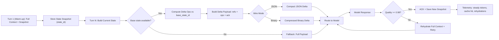

# Token Efficiency Model for Multi-Agent Systems

This package provides a plug in style framework to reduce token usage in multi agent systems (MAS), including compatibility with LLM adapters (e.g., Llama style models).

It implements the tactics for token efficiency:

1. Agent to agent communication compression
2. Smart context pruning
3. **Adaptive semantic sampling**  (NEW: multi-modal intelligent context selection)
4. Shared memory layer
5. Task aware routing
6. Custom protocol (structured compressed agent language)
7. Combined tactics with a Pareto-aware RL orchestrator
8. Stateful `delta` protocol (send diffs + memory references after warm-up)

## Folder Structure

```text
token_efficiency_model/
  agent_communication_compression/
  smart_context_pruning/
  adaptive_semantic_sampling/               NEW
  shared_memory_layer/
  task_aware_routing/
  custom_protocol/
  combined_tactics/
  common/
  experiments/
```

## Quick Start

```bash
cd token_efficiency_model
python3 -m venv .venv
source .venv/bin/activate
pip install -r requirements.txt

# Baseline simulation (60% token reduction)
python experiments/run_simulation.py --episodes 200

# Advanced benchmark with realistic scenarios (improved token reduction)
python experiments/run_advanced_benchmark.py --episodes 200 --scenario-mix balanced

# Test complex scenarios
python experiments/run_advanced_benchmark.py --episodes 150 --scenario-mix complex

# Focus on multi-turn stateful scenarios
python experiments/run_advanced_benchmark.py --episodes 150 --scenario-mix stateful

# Delta protocol benchmark
python experiments/run_delta_benchmark.py
```

## What the Simulation Measures

- Baseline tokens: raw multi-agent transfer
- Optimized tokens: after all tactics
- Token savings (%): efficiency gain
- Quality proxy: estimated task quality after compression/pruning/routing
- RL reward: quality-aware token efficiency objective
- Steady-state tokens: token usage after cache warm-up
- Cold-start tokens: first-turn token cost
- Cache hit rate / rehydration events: delta-path reliability
- **Sampling effectiveness**: how well adaptive sampling balances coverage vs. compression 
- **Diversity score / novelty gain**: how much non-redundant context is preserved per token
- **Pareto decision ratio**: how often orchestration picks non-dominated tactic profiles

## NEW: Adaptive Semantic Sampling

Advanced intelligent context selection that improves upon naive pruning:

### Features
- **Multi-modal scoring**: Combines semantic relevance, entity frequency, recency, and entropy
- **Novelty-aware reranking (MMR-style)**: Explicitly favors non-redundant context slices
- **Anchor retention**: Always keeps a high-signal anchor + latest context for continuity
- **Semantic relevance**: Uses keyword extraction and Jaccard similarity to find task-aligned contexts
- **Frequency scoring**: Identifies important recurring concepts across conversation history
- **Recency bias**: Prioritizes recent contexts while maintaining historical context
- **Information entropy**: Preserves unique information and reduces redundancy
- **Token budget awareness**: Adapts sampling based on token constraints

### How It Works
1. **Semantic Analysis**: Extracts keywords and builds semantic context mapping
2. **Multi-Factor Scoring**: Evaluates each context on 4 dimensions (relevance, frequency, recency, entropy)
3. **Weighted Combination**: Balances factors based on task characteristics
4. **Adaptive Budget**: Adjusts how many contexts to keep based on complexity and tokens
5. **Fallback Modes**: Respects token budgets while maintaining quality thresholds

## NEW: Pareto-Aware RL Orchestration

Unlike one-dimensional policy selection, the orchestrator now optimizes on a two-objective frontier:

- **Expected savings** (token reduction potential)
- **Expected quality** (risk-adjusted answer fidelity)

At runtime, actions are selected from the **Pareto frontier** and scored with a light confidence bonus for under-explored options. This yields policies that are both efficient and robust, instead of overfitting to aggressive compression settings.

### Example
```python
from adaptive_semantic_sampling import AdaptiveSemanticSampler

sampler = AdaptiveSemanticSampler(
    budget=5,
    relevance_weight=0.35,
    frequency_weight=0.25,
    recency_weight=0.20,
    entropy_weight=0.20
)

# Intelligent sampling
sampled_contexts, metrics = sampler.sample(
    contexts=prior_context,
    task_text=task_text,
    adaptive_budget=8  # Override for complex tasks
)

# Token-budgeted sampling
sampled = sampler.sample_with_fallback(
    contexts=prior_context,
    task_text=task_text,
    token_budget=150,
    avg_tokens_per_context=20
)
```

## NEW: Advanced Test Data Generator

Generates nuanced, realistic multi-agent scenarios to test edge cases:

### Scenario Types
- **Multi-Turn Stateful**: Conversations with cumulative state drift over multiple turns
- **High-Complexity Reasoning**: 12+ interdependent constraints requiring careful balance
- **Domain-Specific**: Finance, DevOps, Biology, ML-Ops with specialized vocabularies
- **Cross-Team Communication**: Coordination across teams with different priorities
- **Time-Series Analysis**: Historical data with seasonal patterns, anomalies, infrastructure changes
- **Adversarial Pruning**: Similar-sounding contexts that naive pruning would incorrectly remove
- **Cascading Decisions**: Early choices that constrain downstream options
- **Emergent Behavior**: Many agents with local rules exhibiting system-wide patterns

### Example
```python
from experiments.advanced_test_data import AdvancedTestDataGenerator, ScenarioType

gen = AdvancedTestDataGenerator(seed=42)

# Generate specific scenario types
complex_task = gen.generate_advanced_scenario(ScenarioType.HIGH_COMPLEXITY_REASONING)
stateful_task = gen.generate_advanced_scenario(ScenarioType.MULTI_TURN_STATEFUL)

# Generate realistic workload
workload = gen.generate_workload(count=100, scenario_distribution={
    ScenarioType.MULTI_TURN_STATEFUL: 0.30,
    ScenarioType.HIGH_COMPLEXITY_REASONING: 0.20,
    ScenarioType.DOMAIN_SPECIFIC: 0.25,
    ScenarioType.ADVERSARIAL_PRUNING: 0.15,
    ScenarioType.CROSS_TEAM_COMM: 0.10,
})
```

## Delta Mode (Near-Zero Steady State)

`TokenEfficientPipeline` now supports stateful delta communication:

- `delta_mode="state-delta"`: sends only diff operations against prior state
- `delta_aggressiveness`: controls diff compactness
- `wire_mode="json" | "binary"`: JSON by default, optional compressed binary wire payload
- Quality floor enforcement (default `0.98`) with automatic rehydration fallback

## Architecture Diagrams

### Enhanced Pipeline Flow with Adaptive Semantic Sampling

Live FigJam: [Token Efficiency MAS Flow](https://www.figma.com/online-whiteboard/create-diagram/b400cd26-7735-4d58-b5f9-b188fbdba794?utm_source=other&utm_content=edit_in_figjam&oai_id=&request_id=97355c5e-11f3-4335-aaae-f4b50d8b8195)

```mermaid
flowchart LR
  A["Task Input"] --> B["Agent Communication Compression"]
  B --> C["Adaptive Semantic Sampling"] 
  C --> D["Smart Context Pruning"]
  D --> E["Shared Memory Layer"]
  E --> F{"State Exists?"}
  F -->|"No"| G["Full Payload Build"]
  F -->|"Yes"| H["Delta Ops Builder"]
  H --> I["Custom Protocol Encode"]
  G --> I
  I --> J{"Wire Mode"}
  J -->|"JSON"| K["JSON Payload"]
  J -->|"Binary"| L["Compressed Binary Payload"]
  K --> M["Task-Aware Routing"]
  L --> M
  L --> M{"Small or Large Model"}
  M --> N["Model Backend (Llama/Ollama/API)"]
  N --> O["Quality Floor Check >= 0.98"]
  O -->|"Pass"| P["Save Snapshot + ACK State"]
  O -->|"Fail"| Q["Rehydrate Full Context"]
  Q --> N
  P --> R["Telemetry: Savings, Steady Tokens, Cache Hit"]
```



### Delta Path Focus Flow

Live FigJam: [Delta Path Focus Flow](https://www.figma.com/online-whiteboard/create-diagram/0fb9105a-3784-47f4-82f3-63af48be133e?utm_source=other&utm_content=edit_in_figjam&oai_id=&request_id=227837c1-ccb5-4d0c-b84e-68693a64bf42)



## Plugging Into Real LLMs (Llama, etc.)

Use `combined_tactics.pipeline.TokenEfficientPipeline` with any callable model backend:

```python
def llama_backend(prompt: str, model_name: str) -> str:
    # call your Llama endpoint/client here
    return "model output"

pipeline = TokenEfficientPipeline(model_backend=llama_backend)
result = pipeline.process_task(
    task_text="Summarize security implications of this design.",
    incoming_messages=["agentA: ...", "agentB: ..."],
    prior_context=["system constraints...", "past decision..."],
  delta_mode="state-delta",
  delta_aggressiveness=2,
  wire_mode="json",
)
```

## Notes

- This implementation is lightweight and pure Python (standard library + NumPy).
- The RL module uses tabular Q-learning over tactic-control decisions.
- You can replace the simulation quality proxy with real downstream eval metrics.
